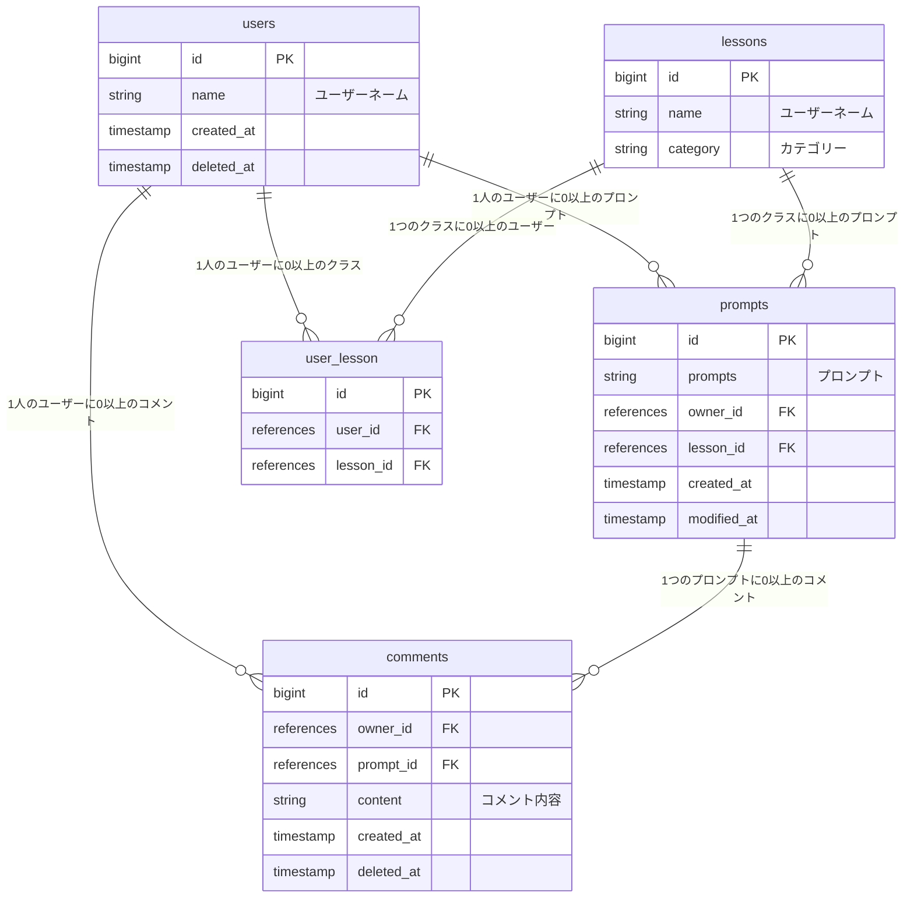

```mermaid
erDiagram
    users ||--o{ comments : "1人のユーザーに0以上のコメント"
    users ||--o{ prompts : "1人のユーザーに0以上のプロンプト"
    users ||--O{ user_lesson : "1人のユーザーに0以上のクラス"
    lessons ||--O{ user_lesson : "1つのクラスに0以上のユーザー"
    prompts ||--o{ comments : "1つのプロンプトに0以上のコメント"
    lessons ||--o{ prompts : "1つのクラスに0以上のプロンプト"

    users {
        bigint id PK
        string name "ユーザーネーム"
        timestamp created_at
        timestamp deleted_at
    }

    lessons {
        bigint id PK
        string name "ユーザーネーム"
        string category "カテゴリー"
    }

    prompts {
        bigint id PK
        string prompts "プロンプト"
        references owner_id FK
        references lesson_id FK
        timestamp created_at
        timestamp modified_at
    }

    comments {
        bigint id PK
        references owner_id FK
        references prompt_id FK
        string content "コメント内容"
        timestamp created_at
        timestamp deleted_at
    }

    user_lesson {
        bigint id PK
        references user_id FK
        references lesson_id FK
    }
  
```
